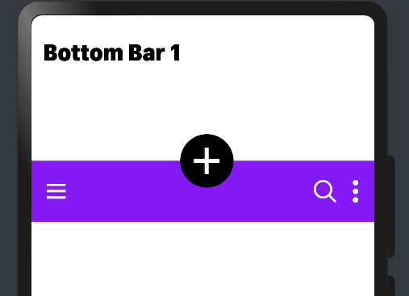
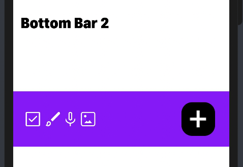

# Material AppBar

This library is developed to provide material bottom bar implemented using extended typescript.

## Installation

```npm install @ohos/material-bottombar --save```

## Instructions for use

1. Import files and code dependencies

```
import { BottomBar, NavigationIcon, FloatingActionButton, OptionMenu } from "@ohos/material-bottombar"
```

2. Code for creating bottom bar design 1

`Declaring models for creating bottom bar`

```
let model: BottomBar.Model = new BottomBar.Model()

let navigationIcon = new NavigationIcon.Model()
      .setIcon($r('app.media.menu'))

    let floatingActionButton = new FloatingActionButton.Model()
      .setFabIcon($r('app.media.plus'))
      .setFabPosition(FabPosition.Center)

    let options = [
      new OptionMenu.Model(1)
        .setIcon($r('app.media.search'))
        .setText('search'),
      new OptionMenu.Model(2)
        .setIcon($r('app.media.settings'))
        .setText('Settings'),
      new OptionMenu.Model(3)
        .setIcon($r('app.media.feedback'))
        .setText('Send Feedback'),
      new OptionMenu.Model(4)
        .setIcon($r('app.media.help'))
        .setText('Help')
    ]

    this.bottomBarModel1
      .setFabPosition(FabPosition.Center)
      .setNavigationIcon(navigationIcon)
      .setFabModel(floatingActionButton)
      .setOptions(options)
      .setBackgroundColor('rgb(145,0,255)')
      .addNavigationListener(this.navigationIconClick)
      .addFabListener(this.fabClick)
      .addOptionListener(this.optionClick)
```


``` 
BottomBar({ model: this.model })
```



3. Code for creating Bottom Bar Design 2

`Declaring models for creating bottom bar`

```
let model: BottomBar.Model = new BottomBar.Model()

let navigationIcon = new NavigationIcon.Model()
      .setIcon($r('app.media.menu'))

    let floatingActionButton = new FloatingActionButton.Model()
      .setFabPosition(FabPosition.Right)
      .setFabIcon($r('app.media.plus'))

    let options = [
      new OptionMenu.Model(1)
        .setIcon($r('app.media.check_box'))
        .setText("check_box"),
      new OptionMenu.Model(2)
        .setIcon($r('app.media.brush'))
        .setText('brush'),
      new OptionMenu.Model(3)
        .setIcon($r('app.media.mic'))
        .setText('mic')
        .setWidth('16vp'),
      new OptionMenu.Model(4)
        .setIcon($r('app.media.images'))
        .setText('images')
    ]

    this.bottomBarModel2
      .setFabPosition(FabPosition.Right)
      .setNavigationIcon(navigationIcon)
      .setFabModel(floatingActionButton)
      .setOptions(options)
      .setBackgroundColor('rgb(145,0,255)')
      .addNavigationListener(this.navigationIconClick)
      .addFabListener(this.fabClick)
      .addOptionListener(this.optionClick)
```


``` 
BottomBar({ model: this.model })
```




## Interface description (BottomBar.Model)

`let model: BottomBar.Model = new BottomBar.Model()`

1. Set navigation icon `model.setNavigationIcon()`
2. Set floating action button model `model.setFabModel()`
3. Set options `model.setOptions()`
4. Set app bar background color `model.setBackgroundColor()`
5. Set callback function for navigation icon click `model.addNavigationListener()`
6. Set callback function for floating action button icon click `model.addFabListener()`
7. Set callback function for option click `model.addOptionListener()`

## Interface description (NavigationIcon.Model)

`let navigationIcon = new NavigationIcon.Model()`

1. Set icon `model.setIcon()`
2. Set width `model.setWidth()`
3. Set height `model.setHeight()`

## Interface description (FloatingActionButton.Model)

`let floatingActionButton = new FloatingActionButton.Model()`

1. Set icon `model.setFabIcon()`
2. Set width `model.setFabWidth()`
3. Set height `model.setFabHeight()`
4. Set icon width `model.setIconWidth()`
5. Set icon height `model.setIconHeight()`
6. Set elevation `model.setFabElevation()`

## Interface description (OptionMenu.Model)

`let optionMenu = new OptionMenu.Model(1, "Option Menu")`

1. Set id & label `new OptionMenu.Model(1, "Option Menu")`
2. Set icon `model.setIcon()`
3. Set width `model.setWidth()`
4. Set height `model.setHeight()`

## Compatibility

Supports OpenHarmony API version 9

## Code Contribution

If you find any problems during usage, you can submit
an [Issue](https://github.com/Applib-OpenHarmony/MaterialAppBarBottom/issues) to us. Of course, we also welcome you to send
us [PR](https://github.com/Applib-OpenHarmony/MaterialAppBarBottom/pulls).

## Open source License

This project is based on [Apache License 2.0](https://github.com/Applib-OpenHarmony/MaterialAppBarBottom/blob/main/LICENSE),
please enjoy and participate in open source freely.

# Reference:

Design by : Amir Ahmed Imtiaz